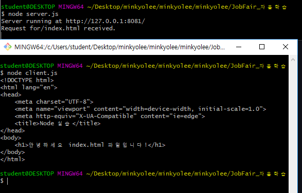

# 1일차

source: <https://velopert.com/node-js-tutorials>

## **Node.js/ Express 프레임워크** 설치 등 환경설정 및 웹서버 구동

## 1. What is Node.js?

> 구글 크롬의 자바스크립트 엔진(V8 Engine)에 기반해 만들어진 서버 사이드 플랫폼이다. 이벤트 기반이며 Non-blocking I/O모델을 사용해 가볍고 효율적이다. Node.js의 패키지 생태계인 npm은 세계에서 가장 큰 오픈 소스 라이브러리라고 할 수 있다.

- __Node는 웹서버가 아니다.__ Node 자체로는 아무것도 하지 않으며 일부 라이브러리의 도움을 받아 HTTP서버를 직접 작성해야한다.


### Node.js의 특징

- __비동기 I/O 처리__  / __이벤트 위주__: Node.js 라이브러리의 모든 API는 비동기식이다 (non-blocking). Node.js기반  API가 실행되었을 때, 데이터를 반환할 때 까지 기다리지 않고 다음 API를 실행한다. 
- 빠른 속도: 구글 크롬의 V8 자바스크립트 엔진을 사용하여 빠른 코드 실행이 가능하다.
- 단일 쓰레드/ 뛰어난 확장성: Node.js는 이벤트 루프와 함께 단일 쓰레드 모델을 사용합니다. 이벤트 메커니즘은 서버가 멈추지 않고 반응하도록 해주어 서버의 확장성을 키워준다. 반면에 일반적인 웹서버(Apache 등)는 요청을 처리하기 위하여 제한된 쓰레드를 생성한다. Node.js는 쓰레드를 한 개만 사용하기 때문에 Apache와 같은 웹서버보다 훨씬 많은 요청을 처리할 수 있다.
- No Buffering: Node.js 애플리케이션에는 데이터 버퍼링이 없으며 데이터를 chunk로 출력한다.
- 라이센스: Node.js는 MIT License가 적용되어있다.


### Node.js가 필요한 경우

- 입출력이 잦은 애플리케이션
- 데이터 스트리밍이 애플리케이션
- 데이터를 실시간으로 다루는 애플리케이션
- JSON API기반 애플리케이션
- SPA 애플리케이션

> But, CPU사용률이 높은 애플리케이션에는 적합하지 못하다는 단점이 존재한다.


## 2. 환경설정

### 1. 로컬 작업환경 설정

​다음의 주소를 통해 Node.js 런타임을 설치한다.

<https://nodejs.org/en/download/>

설치가 끝난 후 npm과 node.js버전을 확인한다.
```
$ npm --version && node --version
>> 6.4.1
>> v10.15.3
```

main.js파일을 하나 생성 후 다음과 같이 작성한다.

```javascript
console.log("Hello Ssafy!!!")
```

__Bash창을 통해 js파일을 실행해주면 다음과 같은 화면이 출력된다.__

```bash
node main.js

>> Hello Ssafy!!!
```


## 3. Node.js 입문

### 1. 필요한 모듈 import 하기

application에 필요한 모듈을 불러올 땐 __require__명령을 사용한다. 

>  ex) HTTP 모듈을 불러오고 반환되는 HTTP 인스턴스를 변수에 저장해보자.
>
> ```javascript
> const http = require("http");
> ```


### 2. 서버 생성하기

앞서 생성한 http 인스턴스를 사용하여 __http.createServer()__ 메소드를 실행한다. 그리고 __listen__ 메소드를 사용하여 포트 8081과 bind를 해준다.

__http.createServer()__ 의 매개변수로는 request와 response를 매개변수로 가지고 있는 함수를 넣어준다.

```javascript
const http = require("http")

http.createServer(function(request, response) {
    response.writeHead(200, {'content-type' : 'text/plain'})
    response.end("성공인가요?")
}).listen(8081)

console.log("Server running at http://127.0.0.1:8081");
```

서버를 실행 후, 성공적으로 실행됐다면 다음과 같은 내용이 출력된다!

```bash
$ node main.js

>> Server running at http://127.0.0.1:8081/
```

> 위의 코드는 8081 로컬 포트를 통해 언제나 __성공인가요?__라는 글자를 리턴하는 웹서버를 생성해준다.

*인코딩 문제가 발생할 때는 다음과 같이 해결해주면 된다.

```javascript
const http = require("http")
// const urlencode = require('urlencode');

http.createServer(function(request, response) {
    response.writeHead(200, {'content-type' : 'text/plain; charset=utf-8'})
    response.end("성공인가요?")
}).listen(8081)

console.log("Server running at http://127.0.0.1:8081");
```


### 3. REPL 터미널

REPL은 __Read Eval Print Loop__의 약자이다. 윈도우 커맨드 혹은 UNIX/ LINUX Shell처럼 사용자가 커맨트를 입력하면 시스템이 값을 반환하는 환경을 가르킨다.

Node.js는 REPL환경과 함께 제공되며 다음과 같은 기능을 수행할 수 있다.

- Read - 유저의 값을 입력받아 Javascript 데이터 구조로 메모리에 저장한다.
- Eval - 데이터를 처리한다.
- Print - 결과값을 출력한다.
- Loop - Read, Eval, Print를 유저가 Ctrl+C를 두번 눌러 종료할때까지 반복한다.

> REPL환경은 자바스크립트 코드를 테스팅 및 디버깅할 때 유용하다!
>
> 터미널창에서 python을 직접실행하여 코드를 쳐보는 것과 같다고 생각하면 된다.

```bash
$ node
# 노드 실행 후 할 일 하기
```

- 기본적으로 자바스크립트로 할 수 있는 모든 일을 할 수 있다고 보면 된다.


### 4. NPM

NPM == Node Package Manager는 두 가지 주요 기능을 지니고 있다.

- NPMSearch에서 탐색 가능한 Node.js 패키지/모듈 저장소
- Node.js 패키지 설치 및 버전/ 호환성 관리를 할 수 있는 커맨드라인 유틸리티

만약 NPM이 구버전이라면 다음과 같은 명령어로 업데이트가 가능하다.

```bash
$ npm install npm -g
```

- LINUX환경에서는 앞에 sudo를 붙여준다.

  

__NPM을 사용하여 모듈을 설치하기__

> npm install <모듈 이름>
>
> 예로 Node.js 웹 프레임워크 중 하나인 express를 설치한다면 다음과 같이 설치 후 사용할 수 있다.

```bash
$ npm install express

----------------------
// main.js
const express = require("express")
```


__글로벌 vs 로컬 모듈 설치 __

기본적으로 npm은 모듈을 로컬모드로 설치한다. 로컬 모드란 패키지를 명령어를 실행한 디렉토리 안에 있는 node_modules 폴더에 설치하는 것을 의미한다.

반면에, 글로벌 설치는 시스팀 디렉토리에 설치하는 것을 의미한다. 

글로벌 모드로 설치하였을 때는 node 어플리케이션에서 바로 `require`할 수가 없다. 따라서 다음처럼 `npm link`명령어를 입력하고나서 해당 모듈을 불러와야한다.

```bash
$ npm install -g express
$ cd [local path]/project
$ npm link express
```


### package.json

package.json은 노드 어플리케이션 / 모듈의 경로에 위치해 있으며 패키지의 속성을 정의한다.

다음은 express로 프로젝트를 생성했을 때 생성되는 package.json이다.

```
{
  "name": "myapp",
  "version": "0.0.0",
  "private": true,
  "scripts": {
    "start": "node ./bin/www"
  },
  "dependencies": {
    "body-parser": "~1.13.2",
    "cookie-parser": "~1.3.5",
    "debug": "~2.2.0",
    "express": "~4.13.1",
    "jade": "~1.11.0",
    "morgan": "~1.6.1",
    "serve-favicon": "~2.3.0"
  }
}
```


### 모듈 제거

다음의 명령어로 설치된 모듈을 제거할 수 있다.

```bash
$ npm uninstall express
```


### 모듈 업데이트

다음의 명령어로 모듈을 업데이트할 수 있다.

```bash
$ npm update express
```


### 모듈 검색

```bash
$ npm search express
```

- 주의) 위 명령어는 처음 이용할 때 메모리를 상당히 많이 잡아먹는다.


## 4. Callback Function

Node.js 에선 callback함수가 상당히 많이 사용된다. callback함수란 자바스크립트에서 어떠한 함수(a)에서 매개변수로써 넘겨지는 또 다른 함수(b)를 의미하며, 해당 함수(a)가 실행될 때 콜백 함수(b)가 실행이 되게 된다.

__Node.js의 특징 중 하나인 non-blocking은 이 callback 함수를 사용함으로써 그 진가를 발휘하게 된다.__

다음의 예제를 통해 확인 가능하다.

```javascript
// input.txt라는 파일을 하나 같은 디렉토리에 생성해준다.

const fs = require("fs")

fs.readFile('input.txt', function(err, data) {
    if (err) return console.log("에러입니다.")
    console.log(data.toString())
})

console.log("프로그램이 종료되었습니다.")
```

- fs모듈은 node에서 파일의 입출력과 관련된 모듈이다. (참조 - <https://opentutorials.org/module/938/7373>)

> 결과화면을 보면, "프로그램이 종료되었습니다"라는 메세지가 먼저 뜨게된다. 이는 fs.readFile함수가 비동기식으로 파일을 읽는 함수이기 때문이다. __이러한 Node.js의 non-blocking 속성은 blocking 속성을 가진 코드에 비해 더 많은 양의 요청을 빠르게 처리할 수 있다는 큰 장점이 있다.__


## 5. HTTP 모듈

1. 우선 node를 통해 보여주고 싶은 index.html을 생성한다.

   ```html
   <!DOCTYPE html>
   <html lang="en">
   <head>
       <meta charset="UTF-8">
       <meta name="viewport" content="width=device-width, initial-scale=1.0">
       <meta http-equiv="X-UA-Compatible" content="ie=edge">
       <title>Node 실습</title>
   </head>
   <body>
       <h1>안녕하세요 index.html 파일입니다!</h1>
   </body>
   </html>
   ```

2. `server.js` 파일을 생성한다.

   ```javascript
   const http = require("http")
   const fs = require("fs")
   const url = require("url")
   
   // 서버 생성하기
   http.createServer( function(request, response) {
       // URL 뒤에 있는 디렉토리 및 파일이름 파싱
       let pathname = url.parse(request.url).pathname
   
       console.log("Request for" + pathname + " received.")
   
       // 파일 이름이 비어있다면 index.html로 설정
       if (pathname === ""){
           pathname = "/index.html"
       }
   
       // 파일 읽기
       fs.readFile(pathname.substr(1), function(err, data){
           if (err) {
               console.log(err)
               // 페이지를 찾을 수 없을 때 발생할 에러
               // HTTP Status : 404 NOT FOUND...
           } else {
               // 페이지가 존재할 때
               // HTTP Status : 200 OK
               response.writeHead(200, {'content-type' : 'text/html; charset=utf-8'})
   
               // 파일을 읽어와서 responseBody에 작성
               response.write(data.toString())
           }
   
           // responseBody 전송
           response.end()
   
       })
   
   }).listen(8081)
   
   // 서버 실행중이라는 표시
   console.log('Server running at http://127.0.0.1:8081/')
   ```


서버 실행 후 앞서 지정한 URL 주소로 들어가면 내가 원하는 HTML파일의 내용이 출력된다.

- <http://127.0.0.1:8081/index.html>


### HTTP 클라이언트 예제

이번에는 서버가 아닌 클라이언트 단에서 요청을 보내는 코드를 작성해보자.

- 서버를 켜놓고 다른 Bash창을 연 후 파일을 실행해야한다.

```javascript
// client.js

const http = require("http")

// HTTPrequest의 옵션 설정
let options = {
    host: 'localhost',
    port: '8081',
    path: '/index.html'
}

// 콜백 함수로 Response를 받아온다.
let callback = function(response) {
    let body = ''
    response.on('data', function(data) {
        body += data
    })

    // end 이벤트가 감지되면 데이터 수신을 종료하고 내용을 출력한다.
    response.on('end', function() {
        console.log(body)
    })
}

// 서버에 HTTP Request를 날린다!
const req = http.request(options, callback)
req.end()
```



​	

## 6. Event Loop (중요)

참조: <https://velopert.com/267>

Node.js에선 Event를 매우 많이 사용하고, 이 때문에 다른 기술들보다 훨씬 빠른 속도를 자랑한다.

Node.js를 기반으로 만들어진 서버가 가동되면 변수들을 `initialize` 하고, 함수를 선언 후 이벤트가 일어날 때 까지 기다린다.

__이벤트 위주 (Event-Driven) 어플리케이션에서는 이벤트를 대기하는 루프가 존재한다.__

이 때, 이벤트가 감지될 시에 callback함수를 호출하게 된다. 콜백함수와 비슷한 이벤트핸들링은 옵저버 패턴에 의해 작동된다. 


이벤트를 대기하는 함수들 (EventListeners) 함수들이 옵저버 역할을 하는데, 이 옵저버들은 이벤트드을 기다리다가 이벤트가 실행되면 이벤트를 처리하는 함수를 실행하게 된다.

Node.js에는 `events모듈`과 `EventEmitter` 클래스가 내장되어있다.

이를 사용하여 이벤트와 이벤트 핸들러를 `bind`시킬수가 있다.

```javascript
// events 모듈 사용
const events = require("events")

// EventEmitter 객체 생성
const eventEmitter = new events.EventEmitter()

// 이벤트 핸들러와 이벤트 연동시키기
// ***eventHandler라는 콜백함수를 따로 정의해줘야한다.
eventEmitter.on('eventName', eventHandler)

// 프로그램안에서 이벤트를 발생시킬 땐 다음 코드를 사용한다.
eventEmitter.emit('eventName')
```

예제 코드)

```javascript
// client.js

let events = require("events")

// eventEmitter 객체 생성
const eventEmitter = new events.EventEmitter()

// eventHandler 함수 생성
let connectHandler = function connected() {
    console.log("Connection Succesfull")

    // data_received 이벤트 발생시키기
    eventEmitter.emit("data_received")
}

// data_received 이벤트와 익명 함수와 연동
eventEmitter.on('connection', connectHandler)

eventEmitter.on('data_received', function(){
    console.log("Data Received")
})

// connection 이벤트 발생시키기
eventEmitter.emit("connection")
console.log("Program has ended")
```


