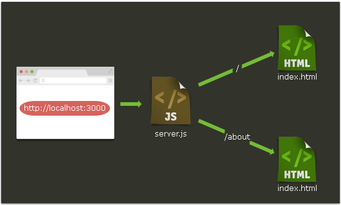
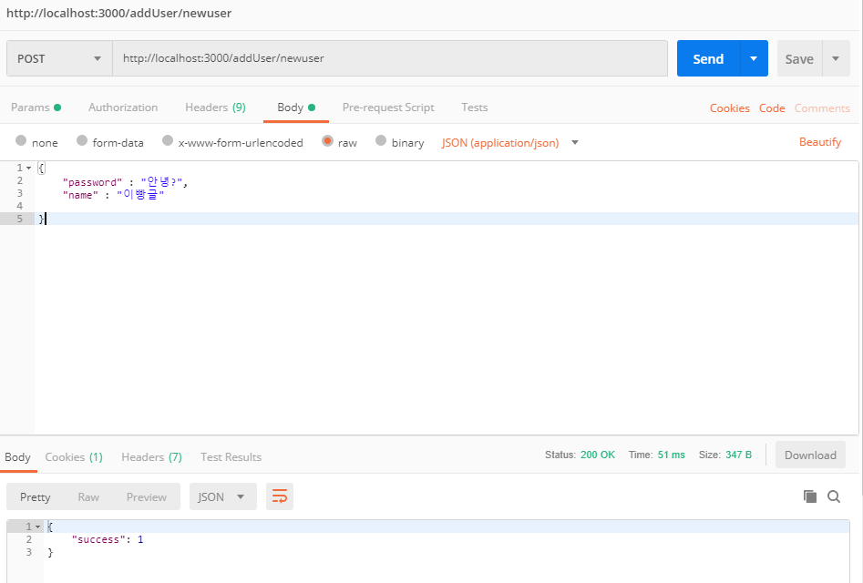

# 2일차

## Node 환경 설정 심화

## NPM

> 참고자료: <https://developer.mozilla.org/en-US/docs/Learn/Serverside/Express_Nodejs/development_environment>

NPM은 Node 애플리케이션을 사용하는데 있어서 가장 중요한 툴이다. 어떤 자바스크립트 라이브러리든 NPM을 통해 설치할 수 있고 관리할 수 있으며, 이러한 관점에서 Express 또한 Node의 구동에 있어서 필요한 하나의 패키지라고 할 수 있다.


참고로 `package.json`이라는 파일을 수정함으로써 NPM을 수동으로 관리할 수도 있다. 파이썬의 `requirements.txt` 처럼 내가 만든 애플리케이션을 구동하는데 있어서 필요한 모든 라이브러리에 대한 리스트를 Json형식으로 담고 있다.


### NPM 사용하기

1. `package.json`파일 생성하기

   ```
   npm init
   ```

2. `package.json` 파일 출력하기

   ```
   cat package.json
   ```

   - cat은 리눅스 명령어 중에서 어떠한 파일을 읽어오고 그 내용을 터미널창에 뿌려주는 명령어이다.


## Express Aplication Generator 설치하기

Express Applicaiton Generator는 Express 애플리케이션의 뼈대(skeleton)를 생성해준다. 

다음의 명령어로 설치해준다.

```bash
$ npm install express-generator -g
```

만약 특정한 이름을 가진 Express로 짜여진 애플리케이션(App)을 실행시키고 싶다면 다음의 명령어로 실행시킬 수 있다.

```
express [앱 이름]
```


## Express 시작

Express는 NodeJS의 대표적인 웹프레임워크 중 하나이다.

일반적인 기초 디렉토리 구조는 다음과 같이 구성된다.

```
express_tutorial/
├── package.json
├── public
│   └── css
│   └── style.css
├── router
│   └── main.js
├── server.js
└── views
 ├── about.html
 └── index.html
```

- 이 때 일부는 자동으로 생성되며 일부는 직접 만들어줘야한다.


1. `package.json` 파일 생성

   - 직접 만들어줘도 된다!

   ```json
   {
     "name": "express-tutorial",
     "version": "1.0.0",
     "dependencies": 
     {
       "express": "~4.13.1",
       "ejs": "~2.4.1"    
     }
   }
   ```

2. NPM으로 Dependencies 설치

   ```bash
   $ npm install
   ```

   

3. Express 서버 생성

   여기까지는 package.json 파일도 생성하고 의존 패키지까지 모두 설치한 상태이다. 이제 서버를 만들어볼 차례이다.

   `server.js`파일을 생성 후 다음의 코드를 입력해 준다.

   ```javascript
   const express = require('express')
   const app = express()
   
   let server = app.listen(3000, function() {
       console.log("Express server has started on port 3000!")
   })
   ```

   이 때, 서버를 실행하면 `Cannot GET / `이라는 메세지가 뜨는데, 얘는 Router를 설정해주지 않았기 때문이다.

4.  `Router`로 `Request` 처리하기!

   여기까지는 서버를 돌리기 위한 모든 작업이 끝난 상태이다. 브라우저에서 request가 왔을 때 어떤 작업을 할지 `router`를 통해 설정해주기만 하면 된다.

   ```javascript
   app.get('/', function(request, response) {
           response.send("제대로 작동하나요?")
       })
   ```

   - 라우터 코드와 서버코드는 다른 파일에 작성하는 것이 좋은 습관이다!

     

router라는 폴더를 만들고 그 안에 main.js를 생성해주자!

```javascript
module.exports = function(app){

    app.get('/', function(req, res) {
        res.render('index.html')
    })

    app.get('/about', function(req, res) {
        res.render('about.html')
    })
}
```

- Django에서 `urls.py`를 작성하는 것과 비슷하다.
- __`module.exports`는 우리가 router 코드를 따로 작성했기 때문에 server.js 파일에서 하나의 모듈로써 불러와서 사용할 수 있도록 해준다!__


5. HTML 페이지 띄우기

   - NodeJS 또한 MVC 패턴으로 디자인 가능하다. 따라서, views라는 디렉토리를 하나 만들어주자.

   - 그 안에 `index.html` 파일과 `about.html` 파일을 만들어주자.

   - 이후,` server.js`를 업데이트 한다.

     ```javascript
     // server.js
     const express = require('express')
     const app = express()
     const router = require('./router/main')(app)
     
     app.set('views', __dirname + '/views')
     app.set('view engine', 'ejs')
     app.engine('html', require('ejs').renderFile)
     
     const server = app.listen(3000, function() {
         consnole.log("Express Server Has Started!!! Yay!")
     })
     ```

     - 3번째줄: 라우터 모듈인 main.js를 불러와서 app에 전달한다.
     - 5번째줄: 서버가 읽을 수 있도록 HTML의 위치를 정의해준다.
     - 6, 7번째줄: 서버가 HTML을 렌더링할 때, EJS엔진을 사용하도록 설정한다.

     > 추가내용정리: __dirname은 현재 수행중인 파일의 위치, 즉 apps.js가 위치한 위치를 뜻한다. 


6. 정적파일 (Static Files) 다루기

   > 정적파일이란 html에서 사용되는 .js파일, .css파일, image파일 등을 가리킨다.
   >
   > 서버에서 정적파일을 다루기 위해선 `exrpess.static()` 메서드를 사용하면 된다.

   - public/css 디렉토리를 만든 후 그 안에 style.css파일을 생성해주자.

   - 이후, server.js의 11번째 줄 아래에 밑의 코드를 추가해주자!

   - (당연히 html파일에서 link태그로 css파일을 불러와줘야한다.)

     ```javascript
     app.use(express.static('public'))
     ```

7. 서버를 다시 실행하여 확인해보자.

   ```bash
   $ node server.js
   ```

   

## Express 프레임워크 응용하기 - EJS

0. __디렉토리 구조__

   data/user.json이 추가되었고 views/내부 파일들이 변경되었다!

   ```
   express_tutorial/
   ├── data
   │   └── user.json
   ├── node_modules
   ├── package.json
   ├── public
   │   └── css
   │       └── style.css
   ├── router
   │   └── main.js
   ├── server.js
   └── views
       ├── body.ejs
       ├── header.ejs
       └── index.ejs
   ```


1. 의존 모듈 추가

   - package.json을 업데이트하자.

     > body-parser와 express-session이라는 디펜던시가 추가되었음을 확인하자.

     ```json
     {
       "name": "express-tutorial",
       "version": "1.0.0",
       "dependencies":
       {
         "express": "~4.13.1",
         "ejs": "~2.4.1"    ,
         "body-parser": "~1.14.2",
         "express-session": "~1.13.0"
       }
     }
     ```

   - 다음의 명령어를 입력해 모듈을 설치한다.

     ```bash
     $ npm install
     ```

   - 추가한 모듈을 server.js에서 불러온다.

     ```javascript
     const express = require('express')
     const app = express()
     const bodyParser = require('body-parser')
     const session = require('express-session')
     const fs = require('fs')
     
     app.set('views', __dirname + '/views')
     app.set('view engine', 'ejs')
     app.engine('html', require('ejs').renderFile)
     
     const server = app.listen(3000, function() {
         console.log("Express Server Has Started!!! Yay!")
     })
     
     app.use(express.static('public'))
     app.use(bodyParser.json())
     app.use(bodyParser.urlencoded())
     app.use(session({
         secret: 'bbangulman@@',
         resave: false,
         saveUninitialized: true
     }))
     
     const router = require('./router/main')(app)
     ```

     - Express의 이전 버전에서는 `cookie-parser`모듈도 불러와야했으나, 이젠 `express-session`모듈이 쿠키에 직접 접근하므로 더이상 사용할 필요가 없다.
     - __또한 router코드를 상단에서 빼서 밑으로 내려줘야하는데, 이는 router코드가 bodyParser코드 아래부분에 있을 시 작동하지 않기 때문이다. 
     - router/main.js에서 첫번째 줄도 업데이트해주자.
     - Node.js에 내장되어있는 fs모듈은 파일을 열기 위해 불러온 것.

   > session 부분을 자세히 알아보자.
   >
   > - secret - 쿠키를 임의로 변조하는것을 방지하기 위한 sign값이며, 원하는 값을 넣으면 된다.
   > - resave - 세션을 언제나 저장할 지 (변경되지 않아도) 정하는 값이다. express-session 공식 문서에서는 이 값을 false로 해두는 것을 권장하고 필요에 따라 true를 사용한다.
   > - saveUninitialized - uninitialized 세션이란 새로 생겼지만 변경되지 않은 세션을 의미한다. 공식 문서에서는 true값을 권장한다.


2. __EJS 템플릿 엔진 __

   > 참고로 EJS란 Embedded Javascript Templates의 약자이며, 장고에서의 DTL과 비슷하다고 할 수 있다.

   Express에서 사용하는 인기있는 `Jade 템플릿 엔진`은 기존의 HTML에 비해 작성법이 완전 다른 반면, EJS는 똑같은 HTML에서 `<% %>`를 사용하여 서버의 데이터를 사용하거나 코드를 실행할 수 있다.

   두가지만 알면 된다.

   1. <% 자바스크립트 코드 %>
   2. <% 출력할 자바스크립트 객체 %>
      - 심지어 router에서 받아올수도 있다.

   #### view로 데이터 넘기기

   index.html과 about.html을 삭제하고 router/main.js를 다음과 같이 수정해주자.

   ```javascript
   module.exports = function(app, fs){
   
       app.get('/', function(req, res) {
           res.render('index', {
               title: "what is this?",
               length: 5
           })
       })
   }
   ```

   - JSON 형식의 데이터를 render 메서드의 두번째 인자로 넘겨줌으로써 페이지에서 데이터를 사용가능하게 된다.

   #### view에서 데이터 접근 및 루프코드 실행

   views/index.ejs를 만들어주자. __확장명이 .ejs다!__

   ```ejs
   <!DOCTYPE html>
   <html lang="en">
   <head>
       <meta charset="UTF-8">
       <meta name="viewport" content="width=device-width, initial-scale=1.0">
       <meta http-equiv="X-UA-Compatible" content="ie=edge">
       <title><%= title %></title>
   </head>
   <body>
       <h1>Loop it!</h1>
       <% for(let i=0; i < length; i++) { %>
           <li>
               <%= "LOOP" + i %>
           </li>
       <% } %>
   </body>
   </html>
   ```

   Django처러 EJS도 코드를 여러 파일로 분리가 가능하다!

   ```
   <% include FILENAME %>
   ```


​	index.ejs 파일의 head와 body를 따로 파일로 저장해서 불러와보자.

​	header.ejs 파일과 body.ejs 파일을 다음과 같이작성해준다.

```ejs
<!-- headers.ejs -->
<title>
    <%= title %>
</title>

<script>
    console.log("headers.ejs has been successfully loaded!")
</script>


<!-- body.ejs -->
<h1>Loop it!</h1>
    <% for(let i=0; i < length; i++) { %>
    <li>
        <%= "LOOP" + i %>
    </li>
<% } %>
```

이후 `index.ejs`에서 `include`를 이용해서 불러와주면 된다!

```ejs
<!-- index.ejs -->
<!DOCTYPE html>
<html lang="en">
<head>
    <meta charset="UTF-8">
    <meta name="viewport" content="width=device-width, initial-scale=1.0">
    <meta http-equiv="X-UA-Compatible" content="ie=edge">
    <% include ./headers.ejs %>
</head>
<body>
    <% include ./body.ejs %>
</body>
</html>
```


3. __Express를 이용한 RESTful API __

> Tip. NodeJs는 MongoDB와 궁합이 잘 맞는다.

우선`data/` 디렉토리를 생성해 준 후, `user.json`이라는 파일을 만들어준다.

```json
{
    "first_user" : {
        "password" : "first_password",
        "name" : "minkyo"
    },
    "second_user" : {
        "password" : "second_password",
        "name" : "changOh"
    }
}
```

`첫번째 API` : GET / list

모든 유저 리스트를 출력하는 GET API를 작성해보자.

우선 user.json 파일을 읽어야 하므로, fs모듈을 사용해보자.

> 중요: server.js에서 마지막에 fs를 다음과 같이 넘겨줘야한다. 
>
> const router = require('./router/main')(app, fs)

```javascript
// router/main.js
module.exports = function(app, fs){

    app.get('/', function(req, res) {
        res.render('index', {
            title: "what is this?",
            length: 5
        })
    })

    app.get('/list', function(req, res) {
        fs.readFile( __dirname + "/../data/" + "user.json", 
        'utf8', function(err, data) {
            console.log(data)
            res.end(data)
        })
    })

}
```

- __dirname은 현재 모듈의 위치를 나타낸다.
- router모듈은 router 폴더에 들어있으니, `data`폴더에 접근하려면 `/..`/를 앞에 붙여서 상위폴더로 먼저 접근해줘야한다.

- 서버를 실행해서 _http://localhost/list__ 에 접속해보자.


`두번째 API`: GET/getUser/:username

이번엔 특정 유저 username의 디테일한 정보를 가져오는 GET API를 작성해보자!

다음과 같이 router/main.js의 list API 아래에 작성해준다.

```javascript
 app.get('/getUser/:username', function(req, res) {
        fs.readFile( __dirname + "/../data/user.json", "utf8", function(err, data) {
            let users = JSON.parse(data)
            res.json(users[req.params.username])
        })
    })
```

- 파일을 읽은 후, 유저 아이디를 찾아서 출력해준다.
- 유저를 찾으면 유저 데이터를 출력하고, 유저가 없다면 {}을 출력하게 된다.
- fs.readFile()로 읽었을 시 __텍스트__형태로 읽히기 때문에 `JSON.parse()`메서드를 사용해야 한다.


`세번째 API`: POST addUser/:username

body: {"password": "_", "name": "_"}

route/main.js파일을 또 수정해주자!

```javascript
// route/main.js

// API POST 방식
    app.post('/addUser/:username', function(req, res){
        let result = {}
        let username = req.params.username

        // 요청 유효성 검증
        if (!req.body["password"] || !req.body["name"]){
            result["success"] = 0
            result["error"]  = "invalid request!!!"
            res.json(result)
            return
        }

        // 데이터 불러오기 + 복사 체크
        fs.readFile( __dirname + "/../data/user.json", "utf8", function(err, data){
            let users = JSON.parse(data)
            if (users[username]) {
                // 복제가 발견되면
                result["success"] = 0
                result["error"] = "duplicated man..."
                res.json(result)
                return
            }

            // 데이터에 추가하기
            users[username] = req.body
            
            // 데이터 저장하기
            fs.writeFile( __dirname + "/../data/user.json",
                        JSON.stringify(users, null, '\t'), 'utf8', function(err, data){
                            result = {"success" : 1}
                            res.json(result)
                        })
        })
    })
```

- JSON 형태가 invalid하다면 오류를 반환하고, valid하다면 파일을 열어서 username의 중복성을 확인 그리고 JSON 데이터에 추가하고 다시 저장하는 흐름이다.

- 성공적인 결과화면은 다음과 같다.

   


